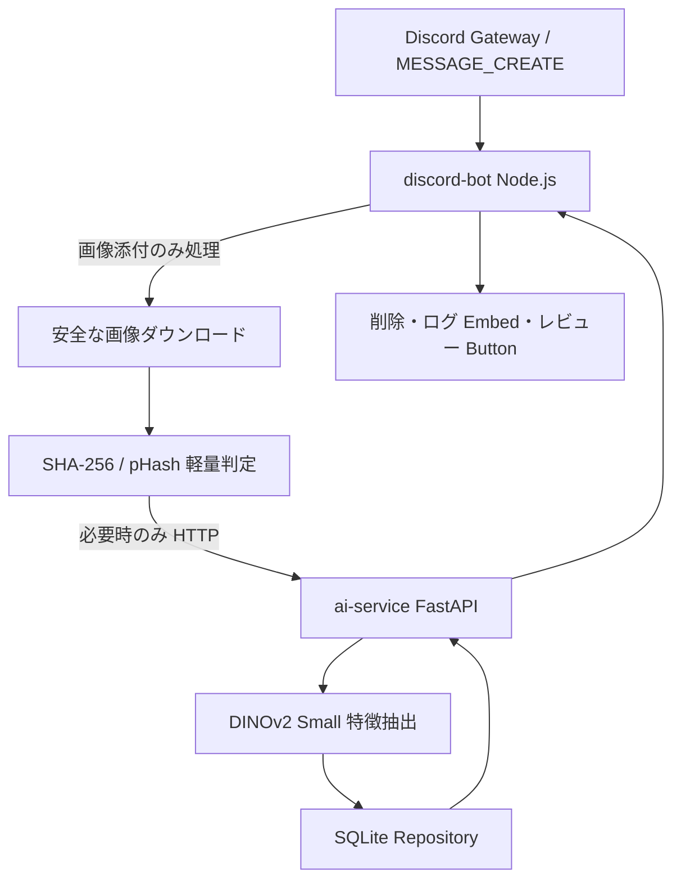

# Discord Image Spam Detection Bot

セルフホスト型の Discord 画像スパム検出 Bot です。Discord に投稿された画像を SHA-256、pHash、DINOv2 Small 埋め込み類似度で段階判定し、自動削除、ログ送信、管理者レビュー、既知スパム画像登録を行う構成を目指します。

## 1. 推奨アーキテクチャ



- Discord Bot は Gateway イベント処理を軽量に保ち、画像がないメッセージは即 return します。
- 初期実装は HTTP API 方式です。将来 BullMQ/Redis Worker へ差し替えやすいよう `services` と `repositories` を分離しています。
- AI 判定はローカル FastAPI サービスで実行し、OpenAI API / Google Cloud Vision / AWS Rekognition などの有料外部 AI API には依存しません。
- SQLite で単一サーバー起動できますが、Repository 層を差し替えることで PostgreSQL / pgvector / FAISS に移行可能です。

## 2. ディレクトリ構造

```text
discord-bot/        Discord Bot 本体 TypeScript / discord.js v14
ai-service/         FastAPI / PyTorch / DINOv2 Small 画像判定サービス
shared/schemas/     Bot と AI Service の JSON Schema
docs/               設計・運用ドキュメント
data/               SQLite DB と画像保存先（git ignore）
docker-compose.yml  Bot + AI Service 起動例
```

## 3. 使用ライブラリ

### Discord Bot

- Node.js 20+
- discord.js v14
- TypeScript
- undici: タイムアウト付き HTTP ダウンロード/API 呼び出し
- sharp: 画像メタデータ検証・正規化
- better-sqlite3: SQLite Repository
- lru-cache: 短期判定 Cache
- p-limit: 同時ダウンロード数制御
- pino: 構造化ログ

### AI Service

- Python 3.11+
- FastAPI / Uvicorn
- Pillow / imagehash: 画像検証と pHash
- PyTorch / Transformers: DINOv2 Small 特徴抽出
- numpy: Cosine Similarity
- pydantic-settings: 環境変数設定

## 4. DB スキーマ案

初期実装の SQLite スキーマは `discord-bot/src/repositories/schema.sql` と `ai-service/app/repositories/schema.sql` にあります。主要テーブルは以下です。

- `guild_settings`: Guild ごとのログチャンネル、自動削除、閾値、共有 DB 利用設定。
- `spam_images`: 既知スパム画像。SHA-256、pHash、DINOv2 embedding、カテゴリ、備考、active フラグを保持。
- `detection_events`: 投稿画像の判定結果、判定方式、類似度、削除有無など。
- `moderation_actions`: Button/管理操作の監査ログ。
- `false_positive_reports`: 誤検知の記録。

## 5. Discord Bot と AI Service 間の API 仕様

### `POST /v1/analyze`

`multipart/form-data`:

- `file`: 画像本体
- `guild_id`: Discord Guild ID
- `message_id`: Discord Message ID
- `sha256`: Bot 側で計算済み SHA-256（任意）
- `phash`: Bot 側で計算済み pHash（任意）

レスポンス例:

```json
{
  "is_spam": true,
  "action": "delete",
  "confidence_level": "high",
  "decision_method": "dinov2",
  "sha256_match": false,
  "phash_distance": 12,
  "ai_similarity": 0.9721,
  "matched_spam_image_id": 15
}
```

### `POST /v1/spam-images`

管理者が画像を既知スパム DB に登録します。登録時に SHA-256、pHash、DINOv2 embedding を一度だけ生成して保存します。

## 6. 判定フロー

1. `messageCreate` 受信。
2. Bot 自身、DM、画像添付なしは即 return。
3. Content-Type、拡張子、サイズを確認。
4. 同時ダウンロード数とタイムアウトを制限して画像を取得。
5. 実データを `sharp` で検証し、SHA-256 を計算。
6. 短期 Cache または SQLite で SHA-256 完全一致判定。
7. pHash が利用可能な場合は軽量近似判定。
8. 軽量判定で確定しない場合のみ AI Service へ送信。
9. 高信頼度は自動削除 + ログ。中間信頼度は設定に応じてレビュー。低信頼度は通過。
10. 管理者 Button 操作を権限確認後、監査ログに保存。

閾値は `.env` で変更できます。DINOv2 類似度は固定の正解値ではなく、実データ分布を見ながら調整してください。

## 7. Phase 1 の実装範囲

この初期実装では以下を含みます。

- Discord Bot 起動、画像添付検出、画像なし即 return。
- 安全な画像ダウンロード、サイズ/拡張子/MIME/画像デコード検証。
- SHA-256 計算、既知スパム画像 SHA 完全一致。
- AI Service HTTP 呼び出しと障害時 Fallback。
- 自動削除、ログ Embed、管理者確認 Button の土台。
- SQLite スキーマ、Repository 分離。
- FastAPI AI Service、pHash、DINOv2 embedding、類似度比較、登録 API。
- Docker Compose と `.env.example`。

## 8. 既存コードへ加える変更点

このリポジトリには実装済みアプリケーションコードがなかったため、新規に `discord-bot/`、`ai-service/`、`shared/`、`docs/` を追加しました。

## セットアップ

```bash
cp discord-bot/.env.example discord-bot/.env
cp ai-service/.env.example ai-service/.env
# .env に DISCORD_TOKEN、CLIENT_ID、必要なら GUILD_ID を設定
# 画像検知には MESSAGE_CONTENT_INTENT=true と Discord Developer Portal 側の有効化が必要
```

### Discord Developer Portal

- OAuth2 URL Generator の Scopes:
  - `bot`
  - `applications.commands`

- Bot Token は `.env` の `DISCORD_TOKEN` に設定し、コードへ直書きしないでください。
- Gateway Intent:
  - `Guilds`
  - `GuildMessages`
  - `MessageContent`: 画像添付を検知するために必要です。既定では Bot が要求します（無効化する場合のみ `MESSAGE_CONTENT_INTENT=false`）。Discord Developer Portal 側で Message Content Intent を有効化していない状態で要求すると `Used disallowed intents` で起動に失敗します。大規模サーバーでは Privileged Intent 審査が必要になる可能性があります。
- 必要権限:
  - View Channels
  - Read Message History
  - Send Messages
  - Embed Links
  - Attach Files
  - Manage Messages
  - Use Application Commands

## 起動

### Docker Compose

```bash
docker compose up --build
```

### ローカル開発

```bash
cd ai-service
python -m venv .venv
. .venv/bin/activate
pip install -r requirements.txt
uvicorn app.main:app --reload
```

```bash
cd discord-bot
npm install
npm run build
npm start
```


### AI Service の初回応答時間

DINOv2 モデルの初回ロードや CPU 推論には時間がかかるため、Bot 側の AI Service HTTP timeout は `.env` で調整できます。`UND_ERR_HEADERS_TIMEOUT` が出る場合は、AI Service が処理中に Bot 側の待ち時間を超えています。

```env
AI_HEADERS_TIMEOUT_MS=180000
AI_BODY_TIMEOUT_MS=300000
```

### AI Service のポート変更

ローカル起動で AI Service を `8004` など別ポートにしたい場合は、`ai-service/.env` と `discord-bot/.env` を合わせてください。

```env
# ai-service/.env
AI_SERVICE_PORT=8004

# discord-bot/.env
AI_SERVICE_URL=http://localhost:8004
```

Docker Compose でホスト側公開ポートを変える場合は、Compose 実行時の環境変数 `AI_SERVICE_PORT=8004` を設定できます。コンテナ間通信では Bot は `http://ai-service:8000` を使います。


## Bot Web 管理画面

Bot 起動中に `http://localhost:3000/dashboard/guilds` から Discord OAuth2 ログインすると、ログインユーザーが管理権限を持ち、かつ Bot が導入されているサーバーだけを管理できます。BOT 運営者向けの全体管理は `BOT_OWNER_USER_IDS` に Discord ユーザー ID を指定したユーザーだけが `http://localhost:3000/admin/guilds` から利用できます。OAuth2 には `CLIENT_SECRET` と `WEB_BASE_URL` の設定が必要です。ポートは `ADMIN_WEB_PORT` で変更できます。Discord Developer Portal の OAuth2 Redirects には、`WEB_BASE_URL` に `/auth/callback` を付けた URL（例: `http://localhost:3000/auth/callback`）を完全一致で登録してください。`redirect_uri が無効です` と表示される場合は、この登録値と `.env` の `WEB_BASE_URL` が一致していません。

## スパム画像管理画面

AI Service 起動中に `http://localhost:8000/v1/admin/spam-images` を開くと、登録済みスパム画像を一覧表示できます。Bot Web 管理画面では、`BOT_OWNER_USER_IDS` に含まれる BOT 運営者でログインした場合だけ、上部ナビゲーションにある「スパム画像管理」から同ページを開けます。誤登録した画像は「削除」ボタンで無効化でき、無効化後は検知対象から外れます。画像ファイル自体は監査・復元用に保存されたままです。`ADMIN_WEB_TOKEN` を設定した場合は、初回アクセス時に `http://localhost:8000/v1/admin/spam-images?token=設定値` を開くことで管理 Cookie が発行され、以降の登録・編集・削除操作にも認証が必要になります。

## ローカルファイルからのスパム画像取り込み

`discord-bot/.env` の `SPAM_IMAGE_IMPORT_DIR` に指定したフォルダ（既定値: `./spam-images`）へ `.png` / `.jpg` / `.jpeg` / `.webp` / `.gif` を置いて Bot を起動すると、起動時に AI Service へスパム画像として自動登録します。既に登録済みの画像は AI Service 側で重複扱いになります。誤って通常画像を入れないよう、このフォルダはローカル管理用として扱ってください。

## 判定しきい値

- `PHASH_MAX_DISTANCE`: 登録済み画像と投稿画像の pHash 距離がこの値以下なら、既に登録済み画像の軽微な再圧縮・リサイズとして `delete` 判定します。既定値は `10` です。DINOv2 類似度だけで届く類似画像は引き続き `review` 判定になります。

## 誤検知報告

- `FALSE_POSITIVE_REPORT_CHANNEL_ID`: BOT管理用チャンネル ID です。レビューボタンで誤検知を選択後、管理者が「報告する」を選んだ場合の誤検知報告に加えて、導入されている全サーバーの画像スパム検知ログとスパム画像登録ログもここへ送信します。未設定の場合、誤検知報告確認は出ますが送信先未設定として通知され、全体ログも送信されません。

## スラッシュコマンド

- `/register-spam-image image [category] [notes]`: 管理者専用。`image` だけ必須で、カテゴリと備考は任意です。添付画像を AI Service へ送り、既知スパム画像として登録します。
- `/spam-log-channel set channel`: サーバーごとの画像スパム検知ログ送信先を設定します。
- `/spam-log-channel show`: 現在の画像スパム検知ログ送信先を表示します。
- `/spam-log-channel clear`: 画像スパム検知ログ送信先の設定を解除します。
- `/ping`: Bot、AI Service、Message Content Intent、検知ログチャンネル設定の状態を確認します。


## Windows startup scripts

Windows で初回セットアップと普段の起動を簡単にするため、`startup/` に batch ファイルを用意しています。

```bat
startup\setup.bat
startup\deploy-commands.bat
startup\start-bot.bat
```

初回は `setup.bat` を実行後、`discord-bot\.env` に `DISCORD_TOKEN` と `CLIENT_ID` を設定してください。その後、コマンド候補を表示するため `deploy-commands.bat` を実行してください。以後は基本的に `start-bot.bat` を起動すれば AI Service と Discord Bot が別ウィンドウで起動します。

## 既知の制限

- pHash 判定の Node.js 側実装は Phase 2 拡張用インターフェースのみで、初期の pHash 計算は AI Service が担当します。
- 大量画像時の本格的なキュー分離、Redis、FAISS/pgvector は将来 Phase 5/6 の拡張対象です。
- DINOv2 モデル初回起動時は Hugging Face からモデルを取得するためネットワークとディスク容量が必要です。運用時はモデルキャッシュを永続化してください。
